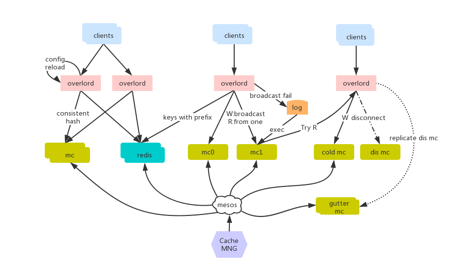

# Overlord 
[](https://travis-ci.org/felixhao/overlord) 
[](http://godoc.org/github.com/felixhao/overlord/proxy) 
[](https://codecov.io/gh/felixhao/overlord)
[](https://goreportcard.com/report/github.com/felixhao/overlord)


Overlord is a proxy based high performance Memcached and Redis solution written in Go.  
It is fast and lightweight and used primarily to horizontally scale your distributed caching architecture.  
It is inspired by Twemproxy,Codis.  

## Quick Start

#### Download

```go
cd $GOPATH/src
git clone https://github.com/felixhao/overlord.git
```

#### Build

```shell
cd $GOPATH/src/overlord/cmd/proxy
go build
```

#### Run

```shell
./proxy -cluster=proxy-cluster-example.toml
```
###### Please first run a memcache server, which bind 11211 port.

#### Test

```shell
# test memcache
echo -e "set a_11 0 0 5\r\nhello\r\n" | nc 127.0.0.1 21211
# STORED
echo -e "get a_11\r\n" | nc 127.0.0.1 21211
# VALUE a_11 0 5
# hello
# END

# test redis
python ./scripts/validate_redis_features.py # require fakeredis==0.11.0 redis==2.10.6 gevent==1.3.5
```

Congratulations! You've just run the overlord proxy.

## Features

- [x] support memcache protocol
- [x] support redis protocol
- [x] connection pool for reduce number to backend caching servers
- [x] keepalive & failover
- [x] hash tag: specify the part of the key used for hashing
- [x] promethues stat metrics support
- [ ] cache backup
- [ ] hot reload: add/remove cluster/node...
- [ ] QoS: limit/breaker...
- [ ] L1&L2 cache
- [ ] hot|cold cache
- [ ] broadcast

## Architecture



# Contributing

Overlord is probably not perfect, but you are welcome to use it in your dev/test/product and so please let me know if anything feels wrong or incomplete.  
I'm trying very hard to keep it simple and fast. And I always happy to receive pull requests. It follow the gitflow, please send you pull request to `develop` branch.  
